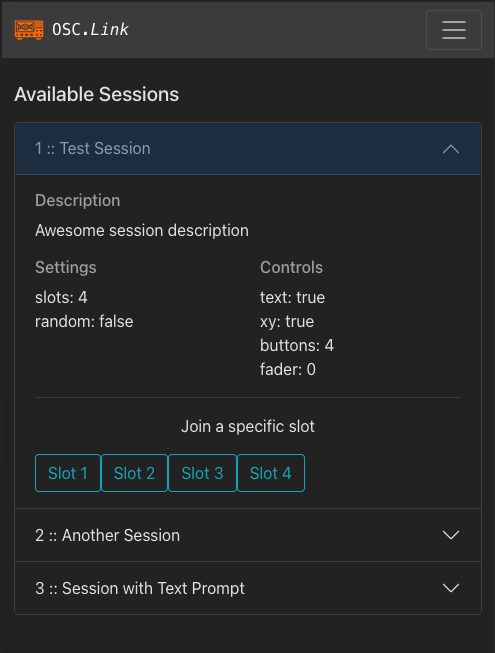
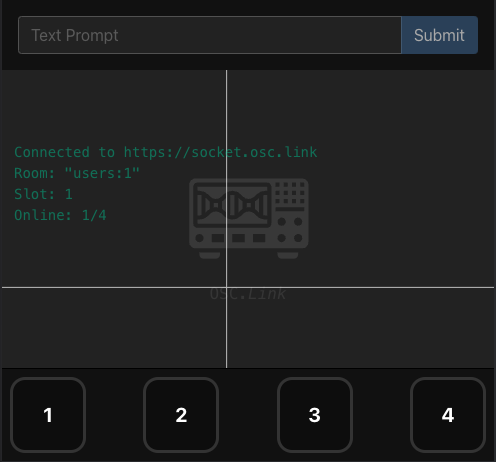

# OSC.LINK
_______________

OSC.LINK is a control interface for realtime interaction between a mobile or desktop browser, and the OSC protocol. It was designed for the rapid-prototyping of multi-user media installations, and simple extensible deployment for mobile phone interaction without the cumbersome steps of joining a network, downloading an app, or signing up for an account.

By snapping a QR code or following a simple URL, user devices are turned into input devices that can send active and passive interaction data to a local client and fed to any platform that can recieve OSC, such as game engines, DAWs or
media servers

___________

### Quickstart:
- Head to the releases page and download the latest platform specific build for your system
- Join an available session from the list available
- Configure your destination application to listen to localhost IP(127.0.0.1), on the hardcoded port 57121
- Interaction data from users that join this session from [osc.link](https://osc.link) will now be sent over UDP to the target destination

______________

### Known Issues:
- [x] "Made by Laubsauger | Powered by socketosc" text needs to be offset with a depth layer behind the UI to avoid space collision conflicts. Currently the second session can't be joined from mobile on iphone13Pro for this reason  (fine on larger screen android), and the conflict is present in Chrome browser, but can be scaled around
- [ ] extra headroom at the bottom of the page and scrollable side panels will make for better UX and control on a small screen
- [ ] wide aspect browser windows on desktop are unable to reach the bottom of the float range on the Y axis of 2d control
- [ ] "Click Here to Join Another Slot" button is broken/inactive
- [ ] "Take a randomly selective slot" button in session 2 doesn't work, joins session 1 user 1
- [ ] on mobile (iPhone 13) buttons send both the true and false messages at the same time, only on button release. seems to work as expected on desktop browser

_____________________

### TO DO / RFE wishlist:
- [x] Deprecate "Disco Diffusion" branch from hamburger menu and publish String field parameter instead as data type
- [ ] fullscreen option for session control screen
- [ ] change Mousedown, button, connect status output from true/false stringbool to 0/1 ints to maintain type consistency
- [ ] host side option to end a session and open a new session, instead of quitting application to join a new session
- [ ] ability to host multiple local sessions, or
- [ ] hostside configuration for IP / Port instead of hardcoded destination
- [ ] host side dashboard for quick visual feedback to see number of slots/connections, indicate activity
- [ ] reverse sorted logging or adjustable limit of console readout for host feedback

_________________
### Future Roadmap:
- implement user credential system for private sessions
- implement admin dashboard for creation and customization of hosted sessions, with Name/Label attributes for each parameter, and a variety of parameter data types
    - button (momentary, toggle and radio type)
    - knob (min / max attributes, endless option, vertical/horz control option)
    - fader (min / max attributes, endless option, vertical/horz control option)
    - 2d pad
    - string float (optional submission button to send the string as a value)
    - dropdown menu
    - colorPicker (thumbnail with popup wheel or RGB/HSB faders)
- Enable passive data from mobile users such as GPS, accelerometer/gyro, roll/tilt/yaw

_______

### Credits:
built and maintained by [Laubsauger](https://github.com/laubsauger)
conception/direction from [DRMBT](https://github.com/drmbt)
prototype and forked from [ThorneBrandt](https://github.com/thornebrandt)

